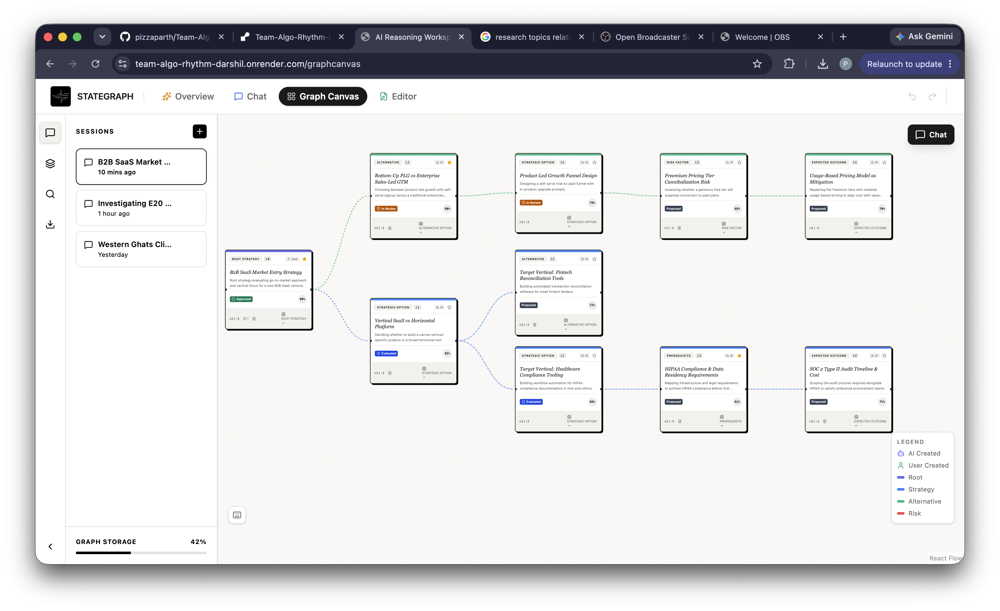

# StateGraph — AI Reasoning Workspace

A collaborative AI-powered reasoning and planning workspace with interactive graph-based decision trees, multi-domain AI research agents, and a full-stack architecture.


## University

**VIT Bhopal University**

| Name | Registration Number |
|------|---------------------|
| Parth Pancholi | 25BCE10443 |
| Darshil Jha | 25BCE10213 |
| Ayushmann Prakash | 25BCE10347 |
| Shaurya Agrawal | 25BCE10402 |

## Screenshots

**Landing Page**


**Decision Graph Canvas**



## Prerequisites

- **Node.js 25+** — Required for the built-in `node:sqlite` module
- Otherwise the server won't start (uses `--experimental-sqlite` flag)

### Checking your Node version

```bash
node --version
# Should be v25.x or later
```

made by- parth and darshil


Install Node 25 via [nvm](https://github.com/nvm-sh/nvm) (recommended):

```bash
nvm install 25
nvm use 25
```

Or download directly from [nodejs.org](https://nodejs.org/en/download/current).

## Getting Started (macOS/Linux)

```bash
# 1. Clone the repo
git clone https://github.com/Darshil1532/temp-polyfix.git
cd temp-polyfix

# 2. Install dependencies (npm or bun both work)
npm install
# or: bun install

# 3. The .env file is already included (private repo) — no setup needed.
#    If you need to change API keys, edit .env directly.

# 4. Run both frontend + backend together
npm run dev:all
```

The app opens at **http://localhost:3000** with the API server at **http://localhost:3002**.

### Running separately

```bash
# Terminal 1: Frontend (Vite)
npm run dev

# Terminal 2: Backend (Express + SQLite)
npm run server:dev
```

## What's Inside

```
├── src/            # React frontend (Vite + TypeScript + Tailwind CSS)
│   ├── components/ # UI components (workspace, chat, landing, common)
│   ├── lib/        # AI pipeline, API client, graph commands
│   ├── store/      # Zustand state management
│   └── types/      # TypeScript types
├── server/         # Express backend (Node 25 + built-in SQLite)
│   ├── database/   # SQLite schema + connection
│   ├── routes/     # REST API routes
│   ├── services/   # Business logic
│   └── middleware/  # Auth, error handling, validation
├── packages/       # Shared packages (WIP)
├── data/           # SQLite database files
├── Dockerfile      # Container build for deployment
├── render.yaml     # Render Blueprint (Docker web service)
└── .env            # API keys (included — repo is private)
```

## Tech Stack

| Layer | Tech |
|-------|------|
| Frontend | React 19, TypeScript, Vite 6, Tailwind CSS 4, Zustand |
| Routing | React Router 7 |
| Graph UI | @xyflow/react (React Flow), dagre |
| Backend | Express 4, Node 25 built-in SQLite |
| Auth | JWT + bcryptjs |
| AI | Mimo AI (LLM), Tavily Search |
| Deployment | Docker, Render |

## Scripts

| Command | What it does |
|---------|-------------|
| `npm run dev` | Start Vite frontend on port 3000 |
| `npm run server:dev` | Start backend with hot reload on port 3002 |
| `npm run dev:all` | Start both concurrently |
| `npm run build` | Production build of frontend |
| `npm run server:build` | Bundle backend for production |
| `npm run lint` | TypeScript type check |

## Deploy on Render

The repo includes a `Dockerfile` and `render.yaml` Blueprint, so deploying is just:

1. Push this repo to GitHub (if it isn't already).
2. In the Render dashboard: **New → Blueprint**, connect the repo. Render reads `render.yaml` and creates the web service automatically (Docker runtime, free plan).
3. Before or after the first deploy, fill in the env vars marked `sync: false` in the Render dashboard (Environment tab): `ALLOWED_ORIGIN` (your Render service URL, e.g. `https://stategraph.onrender.com`), `VITE_MIMO_API_KEY`, `VITE_TAVILY_API_KEY`.
4. Every `git push` to the connected branch triggers an automatic rebuild + redeploy — no manual Docker build/push needed.

**Free tier caveat**: Render's free web services don't include a persistent disk, so the SQLite database resets on every redeploy and on restart after the service spins down from inactivity. Fine for a demo; if you need real data persistence, add a paid Render Disk or switch to a hosted database.

## Troubleshooting

**`Cannot find module 'node:sqlite'`**
→ You need Node.js 25+. Run `node --version` to check.

**`Cannot access '/api/v1/...'`**
→ Make sure you ran `npm run dev:all` (both frontend + backend need to be running).

**Database errors**
→ Delete `data/workspace.db` and restart — the server auto-creates it from `server/database/schema.sql`.
